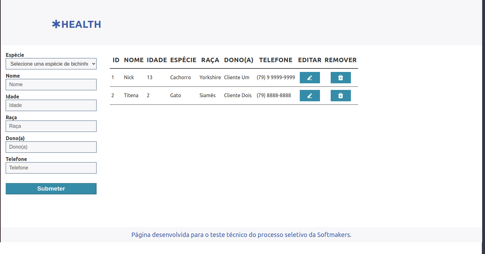

# Desafio - Desenvolvedor Fullstack Júnior 2 - Health
## Introdução
Esta aplicação de controle de uma petshop foi desenvolvida para a etapa de teste técnico do processo seletivo da SoftMakers.

Nela, é possível listar, visualizar, criar, editar e excluir animais de estimação, cujas informações ficam armazenadas em um banco de dados PostgreSQL.

Foram utilizados, durante o desenvolvimento, React.js e CSS no frontend e Node.js, Express JS e Sequelize no back end.



---
## Como executar o projeto
1. Clone o repositório
- ```git clone git@github.com:alvesgf16/health-desafio-desenvolvedor-junior-2.git```
2. Entre na pasta do back end e instale as dependências
- ```cd health-desafio-desenvolvedor-junior-2/api && npm install```
3. Configure as variáveis globais do PostgreSQL
- Crie um arquivo .env a partir do .env.example presente na raiz do back end
  - ```cp .env.example .env```
-  Preencha o arquivo .env criado com suas informações de login no PostgreSQL
    - Exemplo
  ```
  POSTGRES_USER=root
  POSTGRES_PASSWORD=senha_postgres
  POSTGRES_HOST=localhost
  PORT=3001
  ```
4. Inicie o servidor do back end
  - Caso seja necessário, crie o banco de dados antes rodando o comando ```npm run db:create```
  - ```npm start``` 
5. Com o back end inicializado, vá para a pasta do front  end e instale as dependências dele também
  - ```cd ../ui && npm install```
6. Finalmente, a aplicação está pronta para ser rodada
  - ```npm start```
---

## Roadmap fictício
- Criar testes de back end e front end
- Configurar requisitos para CI
- Conteinerizar a aplicação
- Preparar aplicação para deploy